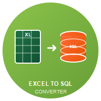

# Excel to SQL Converter

[](htmlcov/index.html)



---

## Descrizione

Questa è una piccola applicazione sviluppata per semplificare e automatizzare la conversione di file Excel in file .sql contenenti istruzioni INSERT
L’obiettivo del progetto è offrire uno strumento semplice, leggero e facilmente integrabile nel proprio flusso di lavoro quotidiano.

---

## Funzionalità Principali

- Interfaccia intuitiva e pulita
- Totalmente standalone, non richiede nessuna installazione
- Esportazione sicura in .sql del tuo file Excel

---

## Come iniziare

Di seguito i passaggi per utilizzare l'applicazione.

1. Scarica l'ultima versione dalla sezione Releases di GitHub.

2. Esegui il file .exe, Windows ti mostrerà un avviso di sicurezza, ignoralo tranquillamente.

3. Seleziona il tuo file Excel: .csv, .xls o .xlsx, scegli tu!

4. Imposta il nome della tabella e dello schema di destinazione; se hai scelto SQL Server definisci anche il nome del database.

5. Seleziona "Converti" e attendi la fine del processo. Il tempo d'attesa varia a seconda della grandezza del file.

6. Il file .sql verrà salvato, insieme al log di esecuzione, nella stessa cartella del file originale.

---

## Testing e Sviluppo

Il progetto include una suite completa di test automatici per garantire qualità e stabilità del codice.

### Esecuzione Test

#### Opzione 1: Script automatico

```bash
./run_tests.bat
```

#### Opzione 2: Comando manuale

```bash
pip install -r requirements-dev.txt
python -m pytest test_excel_to_sql_converter.py -v
```

#### Opzione 3: Con coverage report

```bash
python -m pytest test_excel_to_sql_converter.py -v --cov=excel_to_sql_converter --cov-report=html
```

#### Opzione 4: Coverage locale (senza workflow)

Per generare report di coverage completi in locale (XML, HTML e badge SVG):

```bash
pip install -r requirements-dev.txt
python tools/generate_coverage.py
```

Output generati:

- HTML: `htmlcov/index.html`
- XML: `coverage.xml`
- Badge: `coverage.svg` (opzionale, puoi aggiungerlo al README con ``).

### Test Inclusi

- **Test CSV Loading**: Verifica caricamento robusto CSV con diversi separatori e codifiche
- **Test SQL Formatting**: Controllo generazione SQL per PostgreSQL, SQL Server e Oracle  
- **Test Conversione File**: Test end-to-end del processo di conversione
- **Test Logging**: Verifica corretta creazione e configurazione dei log
- **Test Integrazione**: Workflow completo CSV → SQL con dati realistici

### Continuous Integration

I test vengono eseguiti automaticamente su GitHub Actions per ogni push e pull request su Python 3.9-3.13.
